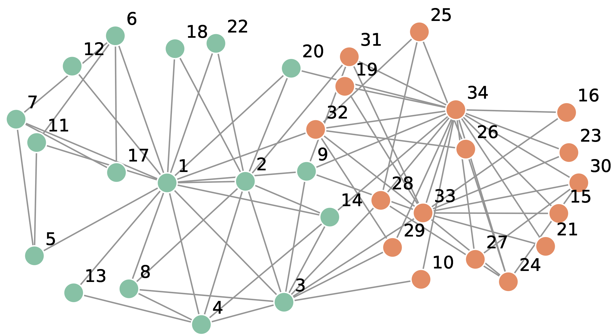

# <a href="https://user.ceng.metu.edu.tr/~gcinbis/courses/Spring24/CENG796">
METU CENG 796 / Spring 24
</a>

# 
Discrete Latent Variable Models

## 
Topic Summary

#### 
Topic Summary Authors

### 
Umut Ozyurt   (umuttozyurt@gmail.com, umut.ozyurt@metu.edu.tr)

### 
Melih Gokay Yigit   (gokay.yigit@metu.edu.tr)

 
 

## Table of contents
1.  [Why Discrete Latent Variables?](#why-discrete-latent-variables)
2.  [Stochastic Optimization](#stochastic-optimization)
3.  [REINFORCE Method](#reinforce-method)
4.  [Variational Learning of Latent Variable Models](#variational-learning-of-latent-variable-models)
5.  [Neural Variational Inference and Learning (NVIL)](#neural-variational-inference-and-learning-nvil)
6.  [Towards Reparameterized, Continuous Relaxations](#towards-reparameterized-continuous-relaxations)
7.  [Categorical Distributions and Gumbel-Softmax](#categorical-distributions-and-gumbel-softmax)
8.  [Combinatorial, Discrete Objects](#combinatorial-discrete-objects-permutations)
11. [Summary and Conclusions](#summary-and-conclusions)
12. [References](#references)

 
 

## Why Discrete Latent Variables?

Discrete latent variables are hidden variables within models that can take on a finite set of distinct values. These variables play a crucial role in decision-making processes and learning structures because they effectively capture the inherent discreteness present in various types of data and systems. This capability is particularly important in real-world data representations, where discrete attributes are often prevalent.

To illustrate the importance of discrete latent variables, consider several examples:

    <figure>
    
    <figcaption><a href="#Fig1">[Fig1]</a>. DNA sequence data representation </figcaption>
    </figure>

 

    <figure>
    
    <figcaption><a href="#Fig2">[Fig2]</a>. Game state data representation from the game named Sokoban.</figcaption>
    </figure>

 

    <figure>
    
    <figcaption><a href="#Fig3">[Fig3]</a>. A network representation of social relationships among the 34 individuals in the karate club studied by Zachary.</figcaption>
    </figure>

Beyond these examples, there are numerous additional data domains where the data is inherently discrete or exhibits discrete characteristics. These domains include text data, images, speech and audio, molecules, geographical data, market basket items, programming codes, healthcare records, financial transactions, e-commerce clickstream data, etc.

The natural and abundant presence of discrete attributes in these data domains shifts the focus toward using discrete latent variable models. These models allow for better capture of the underlying meanings and representations of the data. Moreover, when working with real-world data, continuous latent variable models often face challenges due to the discontinuity of the data. This often necessitates a shift towards discrete latent variables to more accurately model the data and avoid assumption failures inherent in continuous representations.

In summary, the widespread occurrence of discrete data in various domains highlights the necessity of discrete latent variable models. These models provide a more accurate and meaningful representation of the underlying data structures, making them indispensable for working with real-world data.

 

## Stochastic Optimization

The terms "stochastic optimization" is used for the process of minimizing or maximizing an objective function in the case it involves <u>randomness</u>. This non-deterministic optimization process can be useful in many cases, specifically when the data is too large to fit into memory, or when the data is too complex to be processed in a deterministic way (which can reduce the chance of converging to a local minimum if gradient descent is used). 

Recap from VAE content: 

---

We model our data as $p_{\theta}(x)$, where $x$ is the data and $\theta$ is the parameter of the model. We introduce a latent variable $z$, and also introduce a distribution $q(z|x)$ to the model, which leads to:

$$
p_{\theta}(x) = \sum_{\text{All possible values of } z} p_{\theta}(x, z)$$
$$ = \sum_{z \in {Z}} \frac{q(z)}{q(z)} p_{\theta}(x, z)$$
$$ = E_{z \sim q(z)} \left[ \frac{p_{\theta}(x, z)}{q(z)} \right]
$$

We can pick a $q(z)$ that is easy to sample from and outputs related values to the true posterior $p(z|x)$. One of the ways to do this is making $q$ has a parameter $\phi$, and trying to optimize it, minimizing the KL divergence between $q(z|x)$ and $p(z|x)$, which can be made by maximizing the ELBO (Evidence Lower Bound) objective function. 
Roughly, the objective is to maximize the following function (maximizing the ELBO):

$$
\max_{\theta, \phi} E_{q_{\phi}(z|x)} \left[ \log \frac{p_{\theta}(x, z)}{q(z|x)} \right]
$$

---
 

Now, we can consider the following objective: 

$$
\max_{\phi} E_{q_{\phi}(z)}[f(z)]
$$

Here, if we assume $z$ is <b>continuous</b>, $q$ is reparametrizable, and $f$ is differentiable, we can use the <b>reparametrization trick</b> to get the gradient of the expectation w.r.t. $\theta$ :

$$
\max_{\theta, \phi} E_{q_{\phi}(z|x)} \left[ \log \frac{p_{\theta}(x, z)}{q(z|x)} \right]
$$

We can derive:

$$\nabla_{\theta} E_{q(z; \phi)} \left[ \log p(z, \mathbf{x}; \theta) - \log q(z; \phi) \right] = E_{q(z; \phi)} \left[ \nabla_{\theta} \log p(z, \mathbf{x}; \theta) \right]$$

And we can approximate this expectation by Monte Carlo sampling:

$$\approx \frac{1}{k} \sum_{k} \nabla_{\theta} \log p(z^k, \mathbf{x}; \theta)$$

But, what if the assumptions above fails? (z is not continuous).

In this case, we can utilize the REINFORCE Method, explained in th next section.

 
 

## REINFORCE Method

REINFORCE is a monte carlo variation of a policy gradient method which is used to update a network's weights [[1]](#1). It was introduced by Ronald J. Williams in 1992, and the name "<b>REINFORCE</b>" is an acronym for :  
<b>RE</b>ward <b>I</b>ncrement = <b>N</b>on-negative <b>F</b>actor × <b>O</b>ffset <b>R</b>einforcement × <b>C</b>haracteristic <b>E</b>ligibility

It's main goal is to optimize the expected reward, but it can be used in the problems where discrete latent variables or discrete actions exist. We are going to use the REINFORCE method to optimize the following objective function:

$$
\max_{\phi} E_{q_{\phi}(z)}[f(z)]
$$

Here, our policy is $q_{\phi}(z)$, having the parameters $\phi$. With REINFORCE, we try to maximize the expected reward by updating the policy parameters $\phi$. 

But first, we need some mathematical tricks in the computation of the gradients. Normally we want to calculate (or estimate):

$$\frac{\partial}{\partial \phi_{i}} E_{q_{\phi}(z)} [f(z)]$$

But with this form, we cannot calculate the gradient directly (since it is infeasible to calculate the expectation with all possible z values). Furthermore, we cannot estime the gradient by sampling z values from $q_{\phi}(z)$, because the expectation $E_{q_{\phi}(z)}$ is not in the gradient. So, we need to get it out. We can use the following trick to do this:

$$\frac{\partial}{\partial \phi_{i}} E_{q_{\phi}(z)} [f(z)]$$

Expand the expectation:

$$= \frac{\partial}{\partial \phi_{i}} \sum_{z} q_{\phi}(z) f(z)$$

Take the derivative inside the sum:

$$ = \sum_{z} \frac{\partial q_{\phi}(z)}{\partial \phi_{i}} f(z)$$

Introduce $\dfrac{q_{\phi}(z)}{q_{\phi}(z)}$:

$$ = \sum_{z} q_{\phi}(z) \frac{1}{q_{\phi}(z)} \frac{\partial q_{\phi}(z)}{\partial \phi_{i}} f(z)$$

Here is the important part. We have the log-derivative rule $\dfrac{\partial \log q_{\phi}(z)}{\partial \phi_{i}} = \dfrac{1}{q_{\phi}(z)} \dfrac{\partial q_{\phi}(z)}{\partial \phi_{i}}$. So, we can rewrite the equation above as:

$$= \sum_{z} q_{\phi}(z) \frac{\partial \log q_{\phi}(z)}{\partial \phi_{i}} f(z)$$

Now, we can rewrite the equation as an expectation:

$$ = E_{q_{\phi}(z)} \left[ \frac{\partial \log q_{\phi}(z)}{\partial \phi_{i}} f(z) \right] = E_{q_{\phi}(z)} [f(z) \nabla_{\phi} \log q_{\phi}(z)]$$

By making these operations, we can now estimate the gradient by sampling z values from $q_{\phi}(z)$, taking the gradient of the log-probability of the z values, and multiplying it with the function value of z. This is the main idea of the REINFORCE method. 

We are able to sampke $K$ times from $q_{\phi}(z)$, and estimate the gradient as:

$$\nabla_{\phi} E_{q_{\phi}(z)} [f(z)] \approx \frac{1}{K} \sum_{k} f(z^k) \nabla_{\phi} \log q_{\phi}(z^k)$$

This form can be interpreted as a gradient update, weighted in a way which maximizes the expected reward.

TODO: add citations and more comments

## Variational Learning of Latent Variable Models

Variational learning is a powerful technique in probabilistic modeling and Bayesian inference, providing a scalable alternative to traditional methods like Markov Chain Monte Carlo (MCMC). The core idea is to approximate complex, intractable posterior distributions $p(\mathbf{z}|\mathbf{x})$ with a simpler, parameterized family of distributions $q(\mathbf{z}; \phi)$. The parameters $\phi$ of the variational distribution are optimized to minimize the Kullback-Leibler (KL) divergence between $q(\mathbf{z}; \phi)$ and the true posterior $p(\mathbf{z}|\mathbf{x})$.

The variational learning approach typically optimizes the Evidence Lower Bound (ELBO), defined as:

$$
L(\phi) = E_{q(\mathbf{z}; \phi)} \left[ \log p(\mathbf{x}, \mathbf{z}) - \log q(\mathbf{z}; \phi) \right]
$$

Maximizing the ELBO is equivalent to minimizing the KL divergence, thereby making $q(\mathbf{z}; \phi)$ a good approximation of $p(\mathbf{z}|\mathbf{x})$.

While this framework works well for continuous latent variables, handling discrete latent variables introduces significant challenges. Discrete variables do not allow for the straightforward application of gradient-based optimization techniques due to their non-differentiable nature. This makes the direct computation of gradients of the ELBO with respect to the parameters $\phi$ infeasible. Consequently, alternative methods, such as the REINFORCE algorithm, are employed to estimate these gradients.

The ELBO can be expressed as:

$$
L(x; \theta, \phi) = \sum_{z} q_{\phi}(z|x) \log p(z, x; \theta) + H(q_{\phi}(z|x))
$$

or

$$
L(x; \theta, \phi) = E_\{ q_{\phi}(z|x) \}  \log p(z,x;\theta) - \log q_{\phi}(z|x)
$$

Here, the $- \log q_{\phi}(z|x)$ part is also dependent on the $\phi$ parameter. To consider this, we define a function $f$ that includes $\phi$, $\theta$, $z$, and $x$. The objective function can be rewritten as:

$$
E_{q_{\phi}(z|x)} f(\phi, \theta, z, x) = \sum_{z} q_{\phi}(z|x) f(\phi, \theta, z, x)
$$

The REINFORCE rule for this objective function is:

$$
\nabla_{\phi} E_{q_{\phi}(z|x)} f(\phi, \theta, z, x) = E_{q_{\phi}(z|x)} f(\phi, \theta, z, x) \nabla_{\phi} \log q_{\phi}(z|x) + \nabla_{\phi} f(\phi, \theta, z, x)
$$

This rule is more generic since $f$ also depends on the $\phi$ parameter. To estimate the ELBO's gradient with respect to $\phi$ using Monte Carlo, we have:

$$
\nabla_{\phi} E_{q_{\phi}(z)} f(z) \approx \frac{1}{K} \sum_{k} f(z^k) \nabla_{\phi} \log q_{\phi}(z^k)
$$

The REINFORCE rule is viable for gradient estimation with discrete variables but suffers from high variance in gradient estimates, leading to slow convergence. The variance issue arises due to the stochastic nature of the samples used in Monte Carlo estimates. Each sample $\mathbf{z}^{(i)}$ can lead to a significantly different value of the log-likelihood ratio $\log p(\mathbf{x}, \mathbf{z}^{(i)}) - \log q(\mathbf{z}^{(i)}; \phi)$, resulting in large fluctuations in gradient estimates. This high variance can be attributed to:

1. **Inherent stochasticity**: Discrete latent variables amplify the variance in gradient estimates.
2. **Log-likelihood ratio**: The term $\log p(\mathbf{x}, \mathbf{z}^{(i)}) - \log q(\mathbf{z}^{(i)}; \phi)$ can vary widely, especially when $q(\mathbf{z}; \phi)$ is a poor approximation of $p(\mathbf{z}|\mathbf{x})$.

For example, in a Gaussian distribution parameterized by $\theta$:

$$
\nabla_{\theta} E_{q} [x^2]
$$

with $q_{\theta}(x) = N(\theta, 1)$, the variance is:

$$
E_{q} x^2 \nabla_{\theta} \log q_{\theta}(x) = E_{q} x^2 (x - \theta)
$$

Using the reparameterization trick reduces variance, leading to faster convergence:

$$
x = \theta + \epsilon, \quad \epsilon \sim {N}(0, 1)
$$

$$
\nabla_{\theta} E_{q} x^2 = \nabla_{\theta} E_{p} (\theta + \epsilon)^2 = E_{p} 2(\theta + \epsilon)
$$

However, as previously discussed, the reparameterization trick cannot be applied to discrete latent variables. While REINFORCE offers a method for gradient estimation with discrete variables, its high variance presents challenges for efficient optimization. To address this issue, strategies involving control variates will be discussed in the following section.

## Neural Variational Inference and Learning (NVIL)

Neural Variational Inference and Learning (NVIL) represents an advancement in variational inference, particularly tailored for belief networks with discrete latent variables. The high variance in gradient estimates is mitigated in NVIL through the use of control variates.

NVIL extends the traditional variational inference framework by employing neural networks to parameterize the variational distribution $q(\mathbf{z}; \phi)$. The ELBO remains the objective to be maximized:

$$
L(\phi) = E_{q(\mathbf{z}; \phi)} \log p(\mathbf{x}, \mathbf{z}) - \log q(\mathbf{z}; \phi) 
$$

For discrete latent variables, the REINFORCE algorithm is often used to estimate gradients. As noted, this approach suffers from high variance due to the stochastic nature of the samples and the variability in the log-likelihood ratio. NVIL addresses these issues using control variates, significantly reducing variance and enhancing convergence.

Control variates are auxiliary terms that help in reducing the variance of an estimator. In the context of NVIL, these are employed to stabilize the gradient estimates of the ELBO.

1. **Baseline Subtraction**:  
   The variance of the gradient estimator can be reduced by subtracting a baseline $b(x)$ from the objective function:

$$
\nabla_{\phi} E_{q_{\phi}(z|x)} f(\phi, \theta, z, x) = E_{q_{\phi}(z|x)} (f(\phi, \theta, z, x) - b(x)) \nabla_{\phi} \log q_{\phi}(z|x)
$$

   The baseline $b(x)$ is ideally the expectation of $f$, which minimizes the variance of the gradient estimator without introducing bias.

2. **Learned Baselines**:  
   Instead of a fixed baseline, NVIL often uses a neural network to learn an adaptive baseline $b_\psi(x)$:

$$
\nabla_{\phi} E_{q_{\phi}(z|x)} f(\phi, \theta, z, x) = E_{q_{\phi}(z|x)} (f(\phi, \theta, z, x) - b_\psi(x)) \nabla_{\phi} \log q_{\phi}(z|x)
$$

   The parameters $\psi$ of the baseline network are optimized to minimize the variance of the gradient estimates.

3. **Control Variate Networks**:  
   NVIL can incorporate control variate networks, which predict components of the objective function that contribute to high variance. The control variate $c(z)$ is introduced to reduce variance:

$$
\nabla_{\phi} L(\phi) = E_{q_{\phi}(z|x)} (f(\phi, \theta, z, x) - c(z)) \nabla_{\phi} \log q_{\phi}(z|x)
$$

   A well-chosen $c(z)$ can significantly dampen fluctuations in the gradient estimates.

To illustrate the variance reduction, let's compare the REINFORCE rule with and without control variates. The REINFORCE gradient estimate is:

$$
\nabla_{\phi} E_{q_{\phi}(z|x)} f(\phi, \theta, z, x) = E_{q_{\phi}(z|x)} f(\phi, \theta, z, x) \nabla_{\phi} \log q_{\phi}(z|x)
$$

In contrast, with a control variate $c(z)$:

$$
\nabla_{\phi} E_{q_{\phi}(z|x)} f(\phi, \theta, z, x) = E_{q_{\phi}(z|x)} (f(\phi, \theta, z, x) - c(z)) \nabla_{\phi} \log q_{\phi}(z|x)
$$

The variance reduction is mathematically evident if $c(z)$ is a good approximation of $f(\phi, \theta, z, x)$, as it reduces the magnitude of $f(\phi, \theta, z, x) - c(z)$.

Control variates help in reducing variance by effectively isolating the noise component of the gradient estimate. By introducing a term $c(z)$ that approximates the expected value of the objective function, the variability around the mean is reduced. This stabilization allows for more accurate and consistent gradient estimates. Mathematically, this is seen in the term $f(\phi, \theta, z, x) - c(z)$, where $c(z)$ captures much of the fluctuation, leading to a smaller and more stable difference, and thus lower variance.

While NVIL provides significant improvements, it also has limitations:

1. **Complexity**: The introduction of control variate networks and learned baselines increases the computational and implementation complexity. Training additional neural networks alongside the main model requires more resources.

2. **Hyperparameter Sensitivity**: NVIL involves additional hyperparameters, such as those for the control variate networks, which can complicate the optimization process. Finding the right set of hyperparameters can be challenging and may require extensive tuning.

3. **Scalability**: For very large and complex models, the effectiveness of control variates can diminish, as the approximation $c(z)$ might not capture all the variance, especially in high-dimensional spaces.

4. **Dependence on Quality of Control Variates**: The effectiveness of variance reduction heavily relies on the quality of the control variate. If $c(z)$ poorly approximates the true expectation, the variance reduction may be minimal.

The Neural Variational Inference and Learning (NVIL) method significantly enhances the efficiency of variational learning for belief networks with discrete latent variables. By incorporating control variates, NVIL addresses the high variance in gradient estimates, a critical issue in traditional variational learning methods. This results in more stable and faster convergence, making NVIL a powerful approach for complex probabilistic modeling and Bayesian inference. However, the added complexity, hyperparameter sensitivity, and scalability issues necessitate the exploration of more robust and effective algorithms for learning discrete latent variables. In the following sections, we will investigate continuous relaxations of discrete random variables as a widely used alternative.

## Towards Reparameterized, Continuous Relaxations

The term "continuos relaxation" is a technique to approximate the discrete variables with continuous variables. Since we have discrete latent variables and cannot use the reparametrization technique directly, and we have high variance in the REINFORCE method if we do not meticulously adjust the control variates, it is a plausible choice to go with the continuous relaxation to utilize the reparametrization trick.  

To get a continuous relaxation, there is a distribution utilized for this purpose. It is called "Gumbel" distribution, and it is useful in representing the extreme events. 

The CDF of the Gumbel distribution is:

$$F(x; \mu, \beta) = e^{-e^{-(x - \mu)/\beta}}$$

Again, we want to optimize the following objective function by maximizing it:

$$
\max_{\phi} E_{q_{\phi}(z)}[f(z)]
$$

If we choose the Gumbel distribution to be standard ($\mu = 0$ and $\beta = 1$), we can write the Standard Gumbel distribution as:

$$G(x) = e^{-e^{-x}}$$

Here are the example of the Gumbel distribution PDF visualizations for a better understanding:

    <figure>
    
    <figcaption>Fig 5. Gumbel Distribution Probability Distribution Function Visualization (beta is replaced with sigma here here) https://www.researchgate.net/figure/Plot-of-the-Gumbel-distribution-for-various-m-and-s-values_fig1_318519731 </figcaption>
    </figure>

Additional knowledge:  
Note that the mean is not equal to $\mu$. Actually, when the calculations are done, the mean is equal to $\mu + \beta \gamma$, where $\gamma$ is the Euler-Mascheroni constant ($\approx 0.577$). That is why when Gumbel with $\mu = 0 , \beta = 1$ has a different mean than the Gumbel with $\mu = 0 , \beta = 2$ 

 
 

## Categorical Distributions and Gumbel-Softmax

Categorical Distributions represents the discrete probability distribution of a random variable. It has a specific probability assigned to each distinct category. 

We show a categorical distribution $P$ with $K$ categories as: 

$$P(X=k) = \pi_k$$

where $\pi_k$ is the probability of the $k^{th}$ category, and sum of all $\pi_k$ is 1. 

In this conditions, ve can respesent $z$ as a one-hot vector, where $z = \{\pi_1, \pi_2, ..., \pi_K\}$.  

Now, we can apply a calculation known as the Gumbel-Max trick [[4](#4),[5](#5)], which enables sampling from categorical variables, introducing randomness with Gumbel random variables:  

$$\mathbf{z} = \text{onehot} \left( \arg \max_{i} (g_i + \log \pi_i) \right)$$

Here, $g_i$ is a Gumbel random variable sampled from the standard Gumbel distribution ($\mu = 0, \beta = 1$), and $\log \pi_i$ is the log probability of the $i^{th}$ category.  

TODO: continute to this part

Slide 32: 

$$\mathbf{z} = \text{onehot} \left( \arg \max_{i} (g_i + \log \pi) \right)$$

$$\hat{\mathbf{z}} = \text{soft} \max_{i} \left( \dfrac{g_i + \log \pi}{\tau} \right)$$

Slide 33: 

$$\hat{\mathbf{z}} = {\text{soft} \max_{i}} \left( \dfrac{g_i + \log \pi}{\tau} \right)$$

Slide 35: 

$$\max_{\phi} E_{q_{\phi}(z)} [f(z)]$$

$$\max_{\phi} E_{q_{\phi}(\hat{z})} [f(\hat{z})]$$

 
 

## Combinatorial, Discrete Objects: 

### Permutations

In the realm of unsupervised learning, discovering rankings and matchings often necessitates the representation of data as permutations. A $k$-dimensional permutation $\mathbf{z}$ is a ranked list of $k$ indices from the set $\{1, 2, \ldots, k\}$. When dealing with such permutations, we frequently encounter stochastic optimization problems of the form:

$$\max_{\phi} E_{q_{\phi}(\mathbf{z})}[f(\mathbf{z})], $$

where $q_{\phi}(\mathbf{z})$ is a distribution over $k$-dimensional permutations. One straightforward approach to handle this problem is to treat each permutation as a distinct category, such as relaxing the categorical distribution to a Gumbel-Softmax distribution. However, this method quickly becomes infeasible due to the combinatorial explosion; the number of possible $k$-dimensional permutations is $k!$. The Gumbel-Softmax does not scale well for such a large number of categories, making it unsuitable for practical applications involving large $k$.

### Plackett-Luce (PL) Distribution

The Plackett-Luce (PL) distribution offers a practical solution for modeling rankings in various fields such as information retrieval and social choice theory. The $k$-dimensional PL distribution is defined over the set of permutations ${S}_k$ and is parameterized by $k$ positive scores $\mathbf{s}$. The distribution allows for sequential sampling, where the probability of selecting an item at each step is proportional to its score relative to the remaining items. Specifically, the probability of selecting $z_1 = i$ is given by $p(z_1 = i) \propto s_i$.

This process continues sequentially, sampling $z_2, z_3, \ldots, z_k$ without replacement. The probability density function (PDF) for the PL distribution is given by:

$$ q_{\mathbf{s}}(\mathbf{z}) = \frac{s_{z_1}}{Z} \cdot \frac{s_{z_2}}{Z - s_{z_1}} \cdot \frac{s_{z_3}}{Z - \sum_{i=1}^{2}s_{z_i}} \cdots \frac{s_{z_k}}{Z - \sum_{i=1}^{k-1}s_{z_i}}, $$

where $Z = \sum_{i=1}^{k} s_i$ is the normalizing constant.

### Relaxing PL Distribution to Gumbel-PL

To overcome the non-differentiability of the PL distribution, we can employ a reparameterization technique using Gumbel noise. The Gumbel-PL reparameterized sampler involves adding i.i.d. standard Gumbel noise $g_1, g_2, \ldots, g_k$ to the logarithms of the scores $\log s_1, \log s_2, \ldots, \log s_k$. The perturbed log-scores are then given by:
$$
\tilde{s}_i = g_i + \log s_i. 
$$
The permutation $\mathbf{z}$ is determined by sorting the Gumbel-perturbed log-scores $\tilde{s}_1, \tilde{s}_2, \ldots, \tilde{s}_k$. The challenge here is that the sorting operation is non-differentiable. However, recent advancements propose using differentiable relaxations to approximate the sorting process. One such method is described in the paper "Stochastic Optimization for Sorting Networks via Continuous Relaxations," which provides techniques to make the sorting operation amenable to gradient-based optimization.

In summary, by reparameterizing the PL distribution with Gumbel noise and utilizing differentiable relaxations for sorting, we can effectively address the combinatorial challenges and leverage gradient-based methods for optimization in permutation-based models.

## Summary and Conclusions

    <figure>
    
    <figcaption><a href="#Fig4">[Fig4]</a>. Comparison of the Score function estimator (REINFORCE), Reparametrization trick and other methods </figcaption>
    </figure>

## References

### References (contextual)
Example citation generator: 
https://www.scribbr.com/citation/generator/    
TODO: make the references appropriate  
Example reference usage : [[5]](#5)  
Example reference usage : ([Yigit, 2022](#6))  
Example reference usage : ([Ozyurt et al., 2023](#2))
 
 
 

<a id="1">[1]</a> 
Williams, R. J. (1992). Simple statistical gradient-following algorithms for connectionist reinforcement learning. Machine Learning, 8(3–4), 229–256. https://doi.org/10.1007/bf00992696

 

<a id="2">[2]</a> 
Reinforcement learning: An introduction. Sutton & Barto Book: Reinforcement Learning: An Introduction. (n.d.). http://incompleteideas.net/book/the-book-2nd.html 

 

<a id="3">[3]</a> 
Maddison, C. J., Tarlow, D., & Minka, T. (2014, October 31). A* sampling. arXiv.org. https://arxiv.org/abs/1411.0030

 

<a id="4">[4]</a> 
Maddison, C. J., Tarlow, D., & Minka, T. (2014c, October 31). A* sampling. arXiv.org. https://arxiv.org/abs/1411.0030

 

<a id="5">[5]</a> 
Gumbel, E. J. (1954). Statistical theory of extreme valuse and some practical applications. Nat. Bur. Standards Appl. Math. Ser. 33.

 

<a id="6">[6]</a> 
Jang, E., Gu, S., & Poole, B. (2022, July 21). Categorical Reparameterization with Gumbel-Softmax. OpenReview. https://openreview.net/forum?id=rkE3y85ee¬eId=S1LB3MLul

 

<a id="a">[a]</a> 
Gadetsky, A., Struminsky, K., Robinson, C., Quadrianto, N., & Vetrov, D. (2020). Low-Variance Black-Box gradient estimates for the Plackett-Luce distribution. Proceedings of the . . . AAAI Conference on Artificial Intelligence, 34(06), 10126–10135. https://doi.org/10.1609/aaai.v34i06.6572

 

    
<a id="b">[b]</a> 
Oosterhuis, H. (2022). Computationally Efficient Optimization of Plackett-Luce Ranking Models for Relevance and Fairness (Extended Abstract). Proceedings of the Thirty-First International Joint Conference on Artificial Intelligence. https://doi.org/10.24963/ijcai.2022/743

 

<a id="c">[c]</a> 
Richard S. Sutton and Andrew G. Barto. Reinforcement Learning: An Introduction; 2nd Edition. 2017.

 

<a id="d">[d]</a> 
Mnih, A. &amp; Gregor, K.. (2014). Neural Variational Inference and Learning in Belief Networks. <i>Proceedings of the 31st International Conference on Machine Learning</i>, in <i>Proceedings of Machine Learning Research</i> 32(2):1791-1799 Available from https://proceedings.mlr.press/v32/mnih14.html.

 
<a id="e">[e]</a> 
Bishop, C. M. (2006). Pattern Recognition and Machine Learning (Information Science and Statistics). https://dl.acm.org/citation.cfm?id=1162264
 

### References (Figures)

<a id="Fig1">[Fig 1]</a>
DNA sequence data representation: https://www.researchgate.net/figure/A-human-DNA-and-Part-of-DNA-sequence-28-29_fig1_341901570

<a id="Fig2">[Fig 2]</a>
Game state data representation: https://medium.com/deepgamingai/game-level-design-with-reinforcement-learning-52b02bb94954

<a id="Fig3">[Fig 3]</a>
TODO: ADD EXPLANATION AND CITATION

<a id="Fig4">[Fig 4]</a>
Comparison of the Score function estimator (REINFORCE), Reparametrization trick and other methods: https://gabrielhuang.gitbooks.io/machine-learning/content/reparametrization-trick.html

 
 

### Additional Notes:

TODO: Check if the source below citeable

* For the most of the content, slides from cs236 lecture in "Stanford University, prepared by "Stefano Ermon" and "Aditya Grover" have been utilized.   

* Gpt4o is used to strengthen the text in some places, and to obtain equations (from images).
