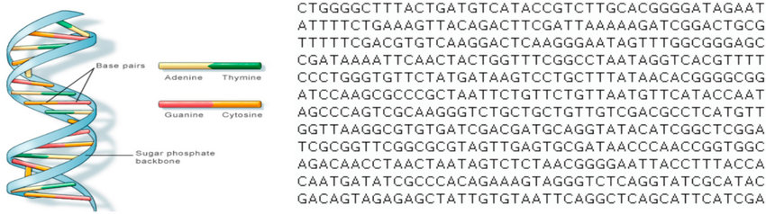

# <a href="[http//www.google.com](https://user.ceng.metu.edu.tr/~gcinbis/courses/Spring24/CENG796)">
METU CENG 796 / Spring 24
</a>

# 
Discrete Latent Variable Models

## 
Topic Summary

#### 
Topic Summary Authors

### 
Umut Ozyurt   (umuttozyurt@gmail.com, umut.ozyurt@metu.edu.tr)

### 
Melih Gokay Yigit   (gokay.yigit@metu.edu.tr)

## Table of contents
1.  [Why Discrete Latent Variables?](#why-discrete-latent-variables)
2.  [Stochastic Optimization](#stochastic-optimization)
3.  [REINFORCE Method](#reinforce-method)
4.  [Variational Learning of Latent Variable Models](#variational-learning-of-latent-variable-models)
5.  [Neural Variational Inference and Learning (NVIL)](#neural-variational-inference-and-learning-nvil)
6.  [Towards Reparameterized, Continuous Relaxations](#towards-reparameterized-continuous-relaxations)
7.  [Categorical Distributions and Gumbel-Softmax](#categorical-distributions-and-gumbel-softmax)
8.  [Combinatorial, Discrete Objects: Permutations](#combinatorial-discrete-objects-permutations)
9.  [Plackett-Luce (PL) Distribution](#plackett-luce-pl-distribution)
10. [Relaxing PL Distribution to Gumbel-PL](#relaxing-pl-distribution-to-gumbel-pl)
11. [Summary and Conclusions](#summary-and-conclusions)
12. [References](#references)

## Why Discrete Latent Variables?

Discrete latent variables are hidden variables in models that take on a finite set of distinct values. They are crucial in decision-making processes and learning structures because they help capture the inherent discreteness in various types of data and systems.  

The most basic understanding for this question stems from the real-world data representations. One can simply observe how the “data” is represented in the examples below:

    <figure>
    
    <figcaption>Fig 1. DNA sequence data representation https://www.researchgate.net/figure/A-human-DNA-and-Part-of-DNA-sequence-28-29_fig1_341901570 </figcaption>
    </figure>

    <figure>
    
    <figcaption>Fig 2. Game state data representation from the game named sokoban https://medium.com/deepgamingai/game-level-design-with-reinforcement-learning-52b02bb94954  </figcaption>
    </figure>

TODO: ADD GRAPH FIGURE:

    <figure>
    
    <figcaption>Fig 3. TODO: ADD EXPLANATION AND CITATION </figcaption>
    </figure>

In addition to the DNA sequence, game state and graph representation examples above, we have many additional data representation domains (e.g. text data, images, speech and audio, molecules, geographical data, market basket items, programming codes, healthcare records, financial transactions, e-commerce clickstream data…) where the data is/has inherently discrete representations. 

This natural (abundant) appearance of this discreteness forces us to use discrete latent variable models since some assumptions may fail in classic latent variable models due to the discontinuity of the data. Hence, if one wants to work with the real-world data using latent variable models, they probably will confront some assumption fails and change their perception to the discrete latent variables realm.

## Stochastic Optimization
Slide 5: 

$$
\max_{\phi} E_{q_{\phi}(z)}[f(z)]
$$

$$
\max_{\theta, \phi} E_{q_{\phi}(z|x)} \left[ \log \frac{p_{\theta}(x, z)}{q(z|x)} \right]
$$

$$
p_{\theta}(x) = \sum_{\text{All possible values of } z} p_{\theta}(x, z) = \sum_{z \in \mathcal{Z}} \frac{q(z)}{q(z)} p_{\theta}(x, z) = E_{z \sim q(z)} \left[ \frac{p_{\theta}(x, z)}{q(z)} \right]
$$

Slide 6: 

$$
\max_{\phi} E_{q_{\phi}(z)}[f(z)]
$$

$$
\max_{\theta, \phi} E_{q_{\phi}(z|x)} \left[ \log \frac{p_{\theta}(x, z)}{q(z|x)} \right]
$$

$$\nabla_{\theta} E_{q(z; \phi)} \left[ \log p(z, \mathbf{x}; \theta) - \log q(z; \phi) \right] = E_{q(z; \phi)} \left[ \nabla_{\theta} \log p(z, \mathbf{x}; \theta) \right]$$

$$\approx \frac{1}{k} \sum_{k} \nabla_{\theta} \log p(z^k, \mathbf{x}; \theta)$$

## REINFORCE Method
Slide 7, 8: 

$$
\max_{\phi} E_{q_{\phi}(z)}[f(z)]
$$

Slide 9-14: 

$$E_{q_{\phi}(z)} [f(z)] = \sum_{z} q_{\phi}(z) f(z)$$

$$\frac{\partial}{\partial \phi_{i}} E_{q_{\phi}(z)} [f(z)] = \sum_{z} \frac{\partial q_{\phi}(z)}{\partial \phi_{i}} f(z) = \sum_{z} q_{\phi}(z) \frac{1}{q_{\phi}(z)} \frac{\partial q_{\phi}(z)}{\partial \phi_{i}} f(z)$$

$$= \sum_{z} q_{\phi}(z) \frac{\partial \log q_{\phi}(z)}{\partial \phi_{i}} f(z) = E_{q_{\phi}(z)} \left[ \frac{\partial \log q_{\phi}(z)}{\partial \phi_{i}} f(z) \right]$$

Slide 15, 16: 

$$E_{q_{\phi}(z)} [f(z)] = \sum_{z} q_{\phi}(z) f(z)$$

$$\nabla_{\phi} E_{q_{\phi}(z)} [f(z)] = E_{q_{\phi}(z)} [f(z) \nabla_{\phi} \log q_{\phi}(z)]$$

$$\nabla_{\phi} E_{q_{\phi}(z)} [f(z)] \approx \frac{1}{K} \sum_{k} f(z^k) \nabla_{\phi} \log q_{\phi}(z^k)$$

## Variational Learning of Latent Variable Models

Slide 17: 

$$\mathcal{L}(x; \theta, \phi) = \sum_{z} q_{\phi}(z|x) \log p(z, x; \theta) + H(q_{\phi}(z|x))$$

$$= E_{q_{\phi}(z|x)}[\log p(z, x; \theta) - \log q_{\phi}(z|x)]$$

$$E_{q_{\phi}(z|x)} [f(\phi, \theta, z, x)] = \sum_{z} q_{\phi}(z|x) f(\phi, \theta, z, x)$$

$$\nabla_{\phi} E_{q_{\phi}(z|x)} [f(\phi, \theta, z, x)] = E_{q_{\phi}(z|x)} [f(\phi, \theta, z, x) \nabla_{\phi} \log q_{\phi}(z|x) + \nabla_{\phi} f(\phi, \theta, z, x)]$$

Slide 18: 

$$E_{q_{\phi}(z)} [f(z)] = \sum_{z} q_{\phi}(z) f(z)$$

$$\nabla_{\phi} E_{q_{\phi}(z)} [f(z)] = E_{q_{\phi}(z)} [f(z) \nabla_{\phi} \log q_{\phi}(z)]$$

$$\nabla_{\phi} E_{q_{\phi}(z)} [f(z)] \approx \frac{1}{K} \sum_{k} f(z^k) \nabla_{\phi} \log q_{\phi}(z^k) : 
= f_{MC}(z^1, \cdots , z^K)$$

$$E_{z^1, \cdots , z^K \sim q_{\phi}(z)} [f_{MC}(z^1, \cdots , z^K)] = \nabla_{\phi} E_{q_{\phi}(z)} [f(z)]$$

Slide 19: 

$$\nabla_{\theta} E_{q} [x^2]$$

$$q_{\theta}(x) = N(\theta, 1)$$

$$E_{q} [x^2 \nabla_{\theta} \log q_{\theta}(x)] = E_{q} [x^2 (x - \theta)]$$

$$x = \theta + \epsilon, \quad \epsilon \sim \mathcal{N}(0, 1)$$

$$\nabla_{\theta} E_{q} [x^2] = \nabla_{\theta} E_{p} [(\theta + \epsilon)^2] = E_{p} [2(\theta + \epsilon)]$$

## Neural Variational Inference and Learning (NVIL)

Slide 27: 

$$\mathcal{L}(x; \theta, \phi) = \sum_{z} q_{\phi}(z|x) \log p(z, x; \theta) + H(q_{\phi}(z|x))$$

$$= E_{q_{\phi}(z|x)} [\log p(z, x; \theta) - \log q_{\phi}(z|x)]$$

$$: 
= E_{q_{\phi}(z|x)} [f(\phi, \theta, z, x)]$$

Slide 28: 

$$\mathcal{L}(x; \theta, \phi, \psi, B) = E_{q_{\phi}(z|x)} [f(\phi, \theta, z, x) - h_{\psi}(x) - B]$$

$$\nabla_{\phi} \mathcal{L}(x; \theta, \phi, \psi, B) = E_{q_{\phi}(z|x)} [(f(\phi, \theta, z, x) - h_{\psi}(x) - B) \nabla_{\phi} \log q_{\phi}(z|x) + \nabla_{\phi} f(\phi, \theta, z, x)]$$

## Towards Reparameterized, Continuous Relaxations

Slide 29: 

$$
\max_{\phi} E_{q_{\phi}(z)}[f(z)]
$$

Slide 30: 

$$g = \max \{y_1, y_2, \ldots, y_n\}$$

$$F(g; \mu, \beta) = \exp \left( - \exp \left( - \frac{g - \mu}{\beta} \right) \right)$$

## Categorical Distributions and Gumbel-Softmax

Slide 31: 

$$\mathbf{z} = \text{onehot} \left( \arg \max_{i} (g_i + \log \pi_i) \right)$$

Slide 32: 

$$\mathbf{z} = \text{one\_hot} \left( \arg \max{_i} (g_i + \log \pi) \right)$$

$$\hat{\mathbf{z}} = \text{soft} \max_{i} \left( \frac{g_i + \log \pi}{\tau} \right)$$

Slide 33: 

$$\hat{\mathbf{z}} = {\text{soft} \max_{i}} \left( \frac{g_i + \log \pi}{\tau} \right)$$

Slide 35: 

$$\max_{\phi} E_{q_{\phi}(z)} [f(z)]$$

$$\max_{\phi} E_{q_{\phi}(\hat{z})} [f(\hat{z})]$$

## Combinatorial, Discrete Objects: 
 Permutations

Slide 36: 

$$\max_{\phi} E_{q_{\phi}(z)} [f(z)]$$

## Plackett-Luce (PL) Distribution

Slide 37: 

$$p(z_1 = i) \propto s_i$$

$$q_s(z) = \dfrac{s_{z1}}{Z} \dfrac{s_{z2}}{Z - s_{z1}} \dfrac{s_{z3}}{Z - \sum_{i=1}^{2}s_{zi}} \cdots \dfrac{s_{zk}}{Z - \sum_{i=1}^{k-1}s_{zi}}$$

where $Z = \sum_{i=1}^{k} s_i$ is the normalizing constant.

## Relaxing PL Distribution to Gumbel-PL

Slide 38: 

$$\tilde{s}_i = g_i + \log s_i$$

## Summary and Conclusions

## References
TODO: make the references appropriate  
 
 
 
[1]: Discrete Latent Variable Models Francesco Bartolucci,1 Silvia Pandolfi,1 and Fulvia Pennoni2 - https://www.annualreviews.org/docserver/fulltext/statistics/9/1/annurev-statistics-040220-091910.pdf?expires=1715703760&id=id&accname=ar-240193&checksum=8413D1CC7F1ED750E3BD979D48DE1B52

